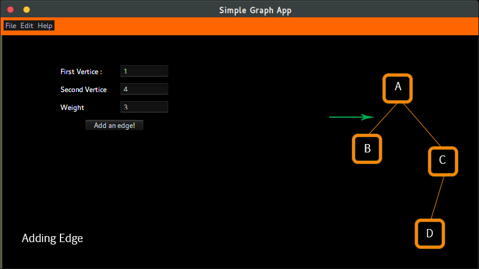
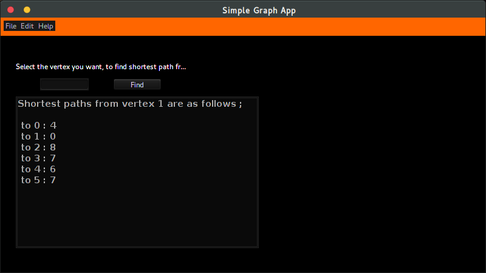
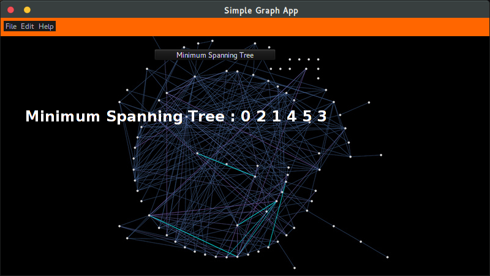

#Graph Data Structure

Implementation of [Graph ADT](http://en.wikipedia.org/wiki/Graph_%28abstract_data_type%29) in Java

#Features
1. Creating a graph by the user input
2. Printing the graph
3. Finding and printing shortest path
4. Printing Minimum Spanning Tree
5. Searching for an element in the graph

#Screenshots

 
